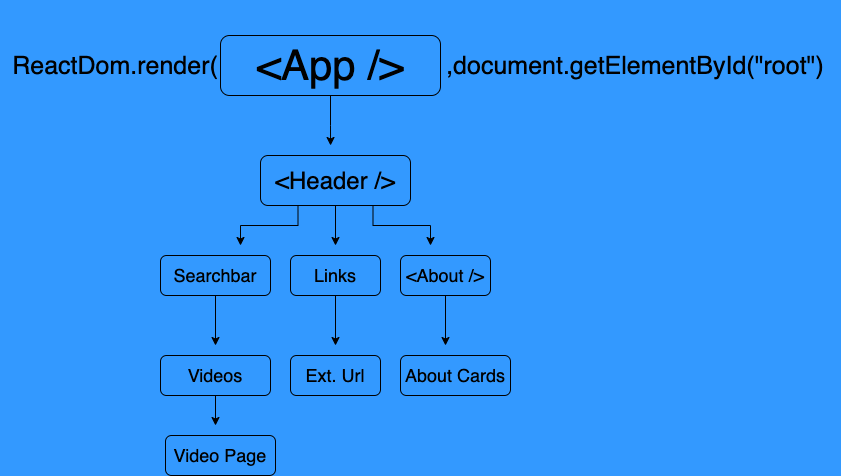

# YouTube Clone

## Table of Contents
- [General Info](#general-info)
- [Component Tree](#component-tree)
- [Low Fidelity Wireframe](#low-fidelity-wire-frame)
- [Trello Board](#trello-board)

## General Info
---
We have created a clone of YouTube using [reactJS](https://reactjs.org/), the [YouTube api](https://github.com/joinpursuit/FSW-React-YouTube/blob/main/Youtube_API_Key.md) and a few other libraries to achieve our desired finish. We practiced thorough conversation throughout the process, pateince, understanding, support and praise through the process. We hope you find this readme, useful and easy to understand.

 
&nbsp  

## Component Tree

 We started off with predicting how we would breakdown the project by building a component tree.  We knew that the larger scale consisted of collecting video data and displaying it, but what about the display did we need to include in it's early stages.  A search bar had to be implemented to make it intuitive for the user to input and await results. Links to an about section, cards for dispalying info, etc. ... This made it easier to get a general idea for how we would make the project more consumable and manageable.   
 
&nbsp  

## Low-Fidelity Wire Frame
---

Now we can start to visualize how we want it all formated. So we drew up a mock version of the YouTube UI, but to include small changes like links to out github repos and an about us section.  

 
&nbsp  

## Trello Board
---
Our Step by Step process to stay on track: 
[trellolink](https://trello.com/b/OzNwrzrY/youtube-clone)
